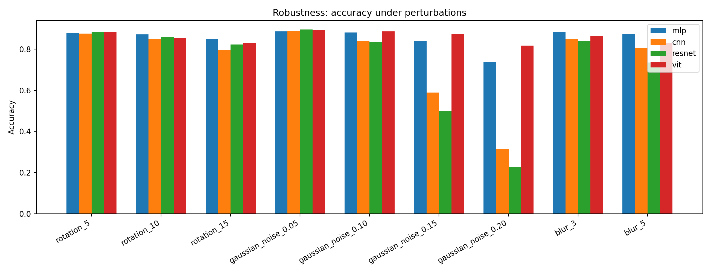
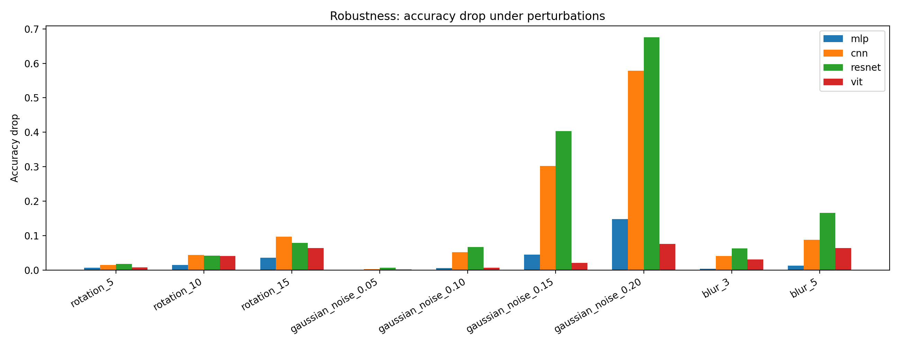
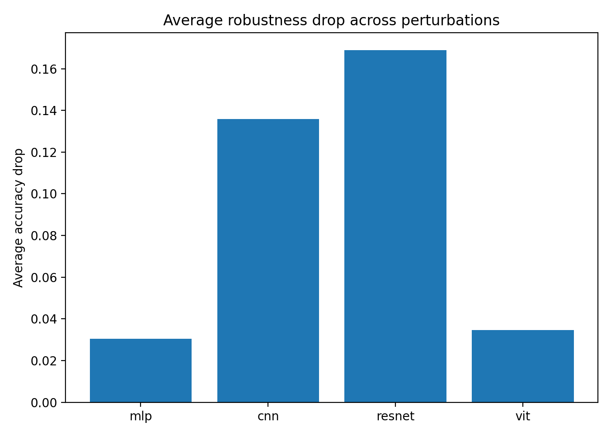

# 6.c 鲁棒性评估分析

## 1. 实验目的

本部分对四个最佳模型进行鲁棒性评估，包括：

- MLP
- CNN
- ResNet
- ViT

实验目标是在原始测试集之外，对测试图像施加轻度到中等强度的扰动，并比较四个模型在不同扰动条件下的性能下降情况。

本实验使用的扰动包括：

- 旋转：`rotation_5`、`rotation_10`、`rotation_15`
- 高斯噪声：`gaussian_noise_0.05`、`gaussian_noise_0.10`、`gaussian_noise_0.15`、`gaussian_noise_0.20`
- 图像模糊：`blur_3`、`blur_5`

评价指标包括：

- accuracy
- macro precision
- macro recall
- macro F1
- accuracy drop

其中，`accuracy drop` 定义为：

```text
accuracy_drop = clean_accuracy - perturbed_accuracy
```

该指标越小，说明模型在该扰动下越鲁棒。

---

## 2. 总体结果图

下图展示了四个模型在不同扰动条件下的 accuracy。可以看到，随着扰动强度增加，整体准确率呈下降趋势，其中高斯噪声对 CNN 和 ResNet 的影响最明显。



下图展示了不同扰动下的 accuracy drop。柱子越高，表示模型在该扰动下性能下降越明显。



下图汇总了每个模型在所有扰动条件下的平均 accuracy drop。



---

## 3. Clean 测试集表现

四个模型在原始测试集上的准确率如下：

| model | clean accuracy | clean F1 |
|---|---:|---:|
| MLP | 0.8865 | 0.8851 |
| CNN | 0.8914 | 0.8908 |
| ResNet | 0.9016 | 0.9014 |
| ViT | 0.8930 | 0.8923 |

可以看到，在无扰动测试集上，ResNet 的准确率最高，其次是 ViT 和 CNN，MLP 略低。  
这说明 ResNet 在标准测试集上具有最强的拟合和分类能力。

## 4. 旋转扰动分析

旋转扰动包括 `5°`、`10°` 和 `15°` 三种强度。随着旋转角度增大，四个模型的准确率整体下降。

平均旋转扰动下降幅度如下：

| model | avg rotation drop |
|---|---:|
| MLP | 0.0194 |
| CNN | 0.0523 |
| ResNet | 0.0462 |
| ViT | 0.0372 |

MLP 对旋转扰动最稳定，可能与其最终最佳版本中使用了数据增强有关。  
CNN 和 ResNet 依赖局部卷积特征，对字符方向和笔画位置变化更敏感，因此旋转角度增大时下降更明显。  
ViT 的下降幅度介于 MLP 和 CNN/ResNet 之间，说明其全局建模能力对旋转扰动有一定缓冲作用。

## 5. 高斯噪声扰动分析

高斯噪声扰动包括 `0.05`、`0.10`、`0.15` 和 `0.20` 四种标准差。结果显示，高斯噪声是本实验中最具破坏性的扰动，尤其对 CNN 和 ResNet 影响最大。

平均高斯噪声下降幅度如下：

| model | avg noise drop |
|---|---:|
| MLP | 0.0498 |
| CNN | 0.2341 |
| ResNet | 0.2882 |
| ViT | 0.0265 |

在 `gaussian_noise_0.20` 下，各模型准确率为：

| model | accuracy under noise 0.20 | accuracy drop |
|---|---:|---:|
| MLP | 0.7389 | 0.1476 |
| CNN | 0.3127 | 0.5787 |
| ResNet | 0.2264 | 0.6752 |
| ViT | 0.8168 | 0.0763 |

可以看到，ViT 在高斯噪声下表现最稳定。  
这可能是因为 ViT 通过 patch token 和 self-attention 建模全局关系，不完全依赖局部边缘和纹理特征，因此对像素级噪声的敏感性相对较低。  
相比之下，CNN 和 ResNet 更依赖局部卷积特征，高斯噪声会明显破坏笔画边缘和局部纹理结构，因此性能下降更严重。

## 6. 模糊扰动分析

模糊扰动包括 `blur_3` 和 `blur_5`。随着模糊强度增大，模型准确率进一步下降。

平均模糊扰动下降幅度如下：

| model | avg blur drop |
|---|---:|
| MLP | 0.0081 |
| CNN | 0.0644 |
| ResNet | 0.1144 |
| ViT | 0.0474 |

MLP 在模糊扰动下下降最小，ViT 次之。  
CNN 和 ResNet 的下降更明显，说明卷积模型对清晰的局部边缘和笔画纹理更依赖。当图像被模糊后，局部边缘信息减弱，卷积模型的性能下降更明显。

## 7. 平均鲁棒性对比

将所有扰动条件综合起来，四个模型的平均 accuracy drop 如下：

| model | average accuracy drop |
|---|---:|
| MLP | 0.0304 |
| CNN | 0.1358 |
| ResNet | 0.1689 |
| ViT | 0.0347 |

整体来看：

- MLP 的平均下降最小；
- ViT 的平均下降也较小，尤其在高斯噪声下最稳定；
- CNN 和 ResNet 在 clean 测试集上准确率较高，但在高斯噪声和模糊扰动下下降明显；
- ResNet 虽然 clean accuracy 最高，但平均鲁棒性下降最大。

## 8. 结论

本实验说明，不同模型在标准测试集和扰动测试集上的表现并不完全一致。

ResNet 在 clean 测试集上表现最好，但在高斯噪声和模糊扰动下下降较大，说明其对局部纹理和边缘特征较敏感。CNN 也表现出类似趋势。MLP 的 clean accuracy 略低，但在旋转和模糊扰动下较稳定，这可能与其最终版本使用了数据增强有关。ViT 在 clean 测试集上表现接近 CNN/ResNet，并且在高斯噪声下具有最好的鲁棒性，说明 self-attention 的全局建模机制有助于缓解像素级噪声对局部特征的破坏。

综合来看：

- 若只考虑 clean accuracy，ResNet 最优；
- 若考虑高斯噪声鲁棒性，ViT 最优；
- 若考虑所有扰动的平均下降，MLP 和 ViT 最稳定；
- CNN 和 ResNet 在标准测试集上表现较强，但对强噪声和模糊扰动更敏感。

因此，鲁棒性评估表明，模型在无扰动数据上的高准确率并不一定意味着其在扰动环境下也最稳定。对于实际应用场景，除了 clean accuracy，还需要结合扰动测试结果综合评价模型的泛化能力和鲁棒性。
